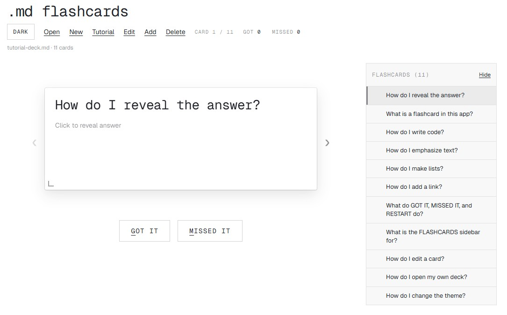

# .md flashcards

**To see this project in action, go to:** [https://iannickgagnon.github.io/dot-md-flashcards/](https://iannickgagnon.github.io/dot-md-flashcards/)

<br>

<div align="center">
  
  <p><em>Main UI with the tutorial deck loaded (see below)</em></p>
</div>

## Another vibecoded flashcard app ... really?

I created this project to use alongside my knowledge base which is mostly in Markdown format (`.md`). I wanted a simple framework that allowed me to create flashcards from my notes using an LLM and open them in a minimal UI to study them.

It's intentionally low-tech, so I will (try to) resist adding the features I don't need that come with other apps (statistics, card themes, etc.). You are absolutely welcome to implement them in your own copy.

I used the xAI theme from [https://getdesign.md/](https://getdesign.md/).

## Overview

Static single-page application (SPA) for studying flashcards defined in Markdown. Each card is a level-2 heading (`##`) and a Markdown answer body. The build output is static assets only; there is no application server. Decks can be opened from disk, edited in the browser, and written back when the host browser exposes a suitable file handle (see [Browsers](#browsers)).

Further authoring rules and examples are in [`public/tutorial-deck.md`](public/tutorial-deck.md) (in-app **Tutorial**). Deck file format rules for LLMs are in [`docs/generate-deck.md`](docs/generate-deck.md):

```markdown
# Deck file format

Follow these rules exactly. Output **must** be **only** the deck file: one Markdown document. Do not wrap it in commentary, labels, or an outer code fence unless the user explicitly asked for that wrapper. The deck **may** start with an optional **deck preamble** (see below); that preamble is part of the file, not meta-instructions to you.

## Document shape

1. **Optional preamble** — Any text from the start of the file **up to but not including** the first **card delimiter line** (defined below). If there is no card delimiter line, the entire file is preamble and produces **zero** cards.
2. **Cards** — Zero or more cards in **file order**. Each card has one **question line** and one **answer body**.

## Card delimiter / question line

- A **card delimiter line** is a line that matches this pattern (regular expression, multiline): start of line, two `#` characters (U+0023), then **one or more** of any character through end of line: `^## (.+)$`
- The line must start at **column 1** (no leading spaces or tabs before the first `#`).
- The **question** is the substring captured by `(.+)`, **trimmed** of leading/trailing whitespace. If that trimmed string is **empty**, the card is **omitted** (skipped).
- **Accidental delimiters:** Because the pattern only requires the first two characters to be `##`, a line intended as an ATX heading with **three** hashes (e.g. `### Section`) still begins with `##`; the parser will treat it as a card question whose title starts with `#`. **Do not** place `###` (or more) at column 1 unless that line is meant to be a new card whose title begins with `#`. Use normal Markdown inside **answer bodies** without starting answer lines at column 1 with `##` unless starting a **new card**:

## Answer body

- The **answer** is all text **after** the card delimiter line up to (but not including) the **next** card delimiter line, or up to **end of file**.
- Leading and trailing whitespace of the answer block is **trimmed** when stored.
- **Markdown:** The answer body is interpreted as **GitHub-flavored Markdown**. Use standard constructs (paragraphs, lists, fenced code with optional language tag, links, emphasis, etc.) as needed.

## Serialization reference

When emitting or normalizing a deck, the following shape is consistent with the app's serializer: optional preamble, then for each card a block `## {title}\n\n{body}`. Blank lines between cards are conventional; newlines **inside** a body are preserved after trim.

## Output check

Before finishing, confirm:

- No text appears **outside** the deck Markdown itself.
- Every intended card has exactly one delimiter line `## …` at column 1 with a **non-empty** title after trim.
- No unintended `##` at column 1 appears inside an answer (unless it starts a new card).
```

## Requirements

- [Node.js](https://nodejs.org/)
- [npm](https://www.npmjs.com/)

## Clone and run locally

```bash
git clone https://github.com/iannickgagnon/dot-md-flashcards.git
cd dot-md-flashcards
npm install
npm run dev
```

Open the URL printed by the dev server. Because [`vite.config.ts`](vite.config.ts) sets `base` to `/dot-md-flashcards/`, local URLs use that path prefix.

## Build

```bash
npm run build
npm run preview
```

Output is written to `dist/`.

## GitHub Pages

The steps below apply to your own fork or copy hosted on GitHub Pages. If the repository is named `dot-md-flashcards`, substitute only your GitHub user or organization for `<github-username>`. **If you rename the repository**, set `base` in [`vite.config.ts`](vite.config.ts) to `"/<new-repo-name>/"` (leading and trailing slash) and use `https://<github-username>.github.io/<new-repo-name>/` as the site URL.

The repository includes [`.github/workflows/deploy-pages.yml`](.github/workflows/deploy-pages.yml). Published URL for a default project site: `https://<github-username>.github.io/dot-md-flashcards/`.

Steps:

1. In the GitHub repository: **Settings**, **Pages**, **Build and deployment**: set **Source** to **GitHub Actions**.
2. Push to `main` (or change the workflow branch if the default branch differs).
3. After a successful run, open the URL above with your account or organization name substituted for `<github-username>`.
4. If the page is blank, confirm the repository name still matches the path segment and that `base` in `vite.config.ts` matches that segment.

For this repository, `npm run dev` and production builds use `base: "/dot-md-flashcards/"` so asset URLs align with the default project path.

## Usage

The application is intended to be self-explanatory, but this section describes a few features and shortcuts I added for convenience.

### Decks

Use the top controls to start or manage a deck:

| Control | Purpose |
|---|---|
| **Open** | Select an existing deck file. |
| **New** | Create an empty deck using a save dialog. |
| **Tutorial** | Load the bundled tutorial deck. |
| **Drag & drop** | Drop a `.md` file onto the drop zone to load it. |

In Chromium-based browsers, the app may keep a file handle, allowing future saves to update the same file directly.

### Header Controls

| Control | Description |
|---|---|
| **Theme** | Switch between light and dark mode. The choice is saved in `localStorage`. |
| **Open** | Load a deck from a file. |
| **New** | Create a new empty deck. |
| **Tutorial** | Load the bundled tutorial deck. |
| **Edit** | Edit the current card. |
| **Add** | Append a new card.|
| **Delete** | Delete the current card. |

### Studying Cards

Click a card to flip it, or focus the card and press **Enter** or **Space**.

Use the side controls or arrow keys to move between cards.

| Control | Behavior |
|---|---|
| **GOT IT** | Mark the current card as understood. Equivalent to `G` key. |
| **MISSED IT** | Mark the current card as missed. Equivalent to `M` key. |
| **RESTART** | Appears once all cards have been marked. Equivalent to `R` key. |

The sidebar lists all cards and lets you jump directly to any card.

### Editing Cards

You can edit a card in any of the following ways:

| Method | Action |
|---|---|
| **Edit** button | Edit the current card. Equivalent to `E` key. |
| **Add** button | Append a new card. |

Use **Save** to serialize the full deck. Save behavior depends on browser support and whether a file handle is available.

## Deck format (summary)

- **Card delimiter:** line starting with `## ` (only level-2 headings start cards).
- **Answer:** Markdown from that line until the next `##` or end of file.

> [!TIP]
> The deck format is described in [`public/tutorial-deck.md`](public/tutorial-deck.md) and can be loaded by clicking **Tutorial** in the header. **Feed it to your LLM to make it generate decks/questions for you.**

## Layout

| Path | Role |
|------|------|
| [`src/main.ts`](src/main.ts) | Bootstrap, file IO wiring, shortcuts, drag and drop |
| [`src/study/renderStudyUi.ts`](src/study/renderStudyUi.ts) | Main UI and flashcard chrome |
| [`src/app/context.ts`](src/app/context.ts) | Application state and DOM references |
| [`src/fs/markdownFileWriter.ts`](src/fs/markdownFileWriter.ts) | File System Access writes |
| [`src/parseFlashcards.ts`](src/parseFlashcards.ts) | Parse and serialize decks |
| [`src/renderMarkdown.ts`](src/renderMarkdown.ts) | Markdown to HTML (Marked, DOMPurify, highlight.js) |

## Dependencies

[Vite](https://vitejs.dev/), [TypeScript](https://www.typescriptlang.org/), [marked](https://marked.js.org/), [DOMPurify](https://github.com/cure53/DOMPurify), [highlight.js](https://highlightjs.org/), [Geist via Fontsource](https://fontsource.org/).
